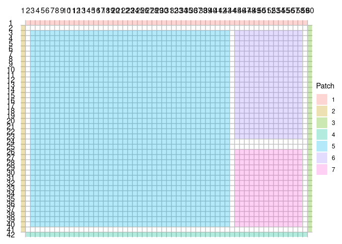
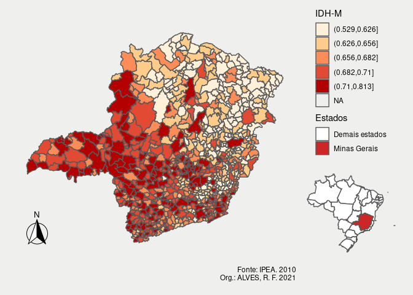

Mapa do IDHM de Minas Gerais
================

``` r
library(tidyverse)
library(sf)
library(patchwork)
library(ggspatial)
library(readxl)
library(geobr)
```

``` r
uf <- read_state(showProgress = FALSE)
mun <- read_municipality(showProgress = FALSE)
```

``` r
idhm <- read_xlsx("data/Atlas 2013_municipal, estadual e Brasil.xlsx", sheet = 2) %>%
    filter(ANO == 2010, UF == 31) %>%
    select(code_muni = Codmun7, IDHM)

head(idhm)
```

    ## # A tibble: 6 x 2
    ##   code_muni  IDHM
    ##       <dbl> <dbl>
    ## 1   3100104 0.689
    ## 2   3100203 0.698
    ## 3   3100302 0.654
    ## 4   3100401 0.63 
    ## 5   3100500 0.61 
    ## 6   3100609 0.576

``` r
base <- inner_join(mun, idhm, "code_muni")

head(base)
```

    ## Simple feature collection with 6 features and 5 fields
    ## geometry type:  MULTIPOLYGON
    ## dimension:      XY
    ## bbox:           xmin: -47.67975 ymin: -20.45584 xmax: -42.04516 ymax: -17.7664
    ## geographic CRS: SIRGAS 2000
    ##   code_muni           name_muni code_state abbrev_state  IDHM
    ## 1   3100104 Abadia Dos Dourados         31           MG 0.689
    ## 2   3100203              Abaeté         31           MG 0.698
    ## 3   3100302          Abre Campo         31           MG 0.654
    ## 4   3100401             Acaiaca         31           MG 0.630
    ## 5   3100500             Açucena         31           MG 0.610
    ## 6   3100609            Água Boa         31           MG 0.576
    ##                             geom
    ## 1 MULTIPOLYGON (((-47.48345 -...
    ## 2 MULTIPOLYGON (((-45.24166 -...
    ## 3 MULTIPOLYGON (((-42.49664 -...
    ## 4 MULTIPOLYGON (((-43.12231 -...
    ## 5 MULTIPOLYGON (((-42.38168 -...
    ## 6 MULTIPOLYGON (((-42.41357 -...

``` r
main_map <- base %>%
    mutate(IDHM = cut(IDHM, quantile(IDHM, probs = seq(0, 1, by = .2)))) %>%
    ggplot() +
    geom_sf(aes(fill = IDHM), size = .5) +
    scale_fill_brewer("IDH-M", palette = "OrRd") +
    annotation_north_arrow(style = north_arrow_fancy_orienteering()) +
    annotation_scale(pad_x = unit(140, "mm")) +
    labs(caption = "Fonte: IPEA. 2010\nOrg.: ALVES, R. F. 2021")
```

``` r
context_map <- uf %>%
    mutate(estados = ifelse(code_state == "31", "Minas Gerais", "Demais estados")) %>%
    ggplot() +
    geom_sf(aes(fill = estados)) +
    scale_fill_manual("Estados", values = c("white", "firebrick3"))
```

``` r
layout <- c(
    area(1, 2, 1, 59),
    area(2, 1, 41, 1),
    area(2, 60, 41, 60),
    area(42, 2, 42, 59),
    area(3, 3, 40, 43),
    area(3, 45, 23, 58),
    area(26, 45, 40, 58)
)

plot(layout)
```

<!-- -->

``` r
patch <- plot_spacer() + plot_spacer() + plot_spacer() + plot_spacer() +
    main_map + guide_area() + context_map +
    plot_layout(guides = "collect", design = layout) &
    theme_void() +
    theme(
        plot.background = element_rect(fill = "#efefee", size = 0),
        panel.background = element_rect(fill = "#efefee", size = 0)
    )

patch
```

<!-- -->

``` r
ggsave("plots/plot.png", patch, device = "png", width = 297, height = 210, units = "mm")
ggsave("plots/plot.pdf", patch, device = "pdf", width = 297, height = 210, units = "mm")
```
